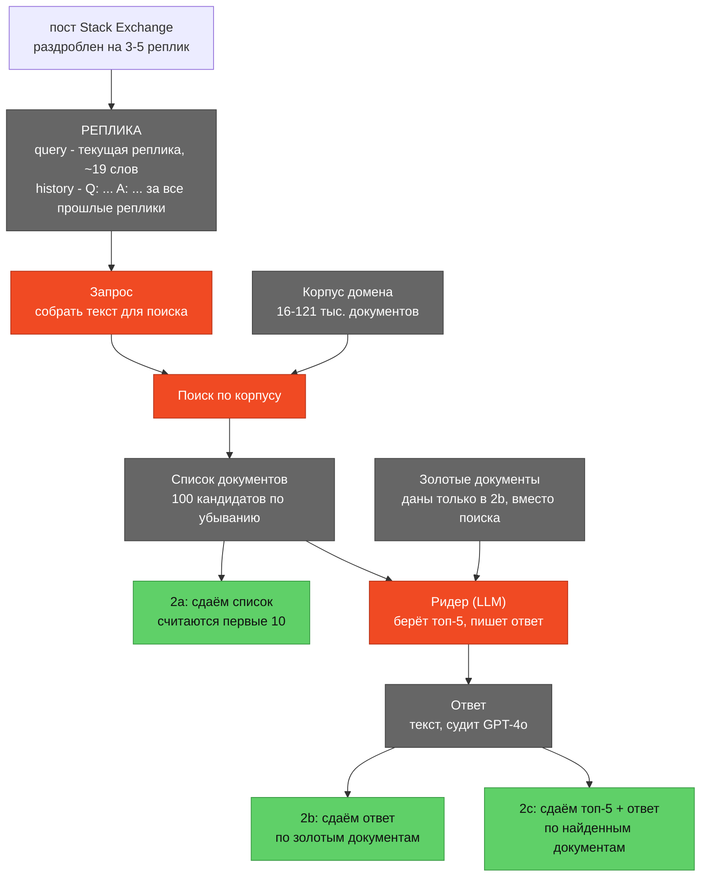
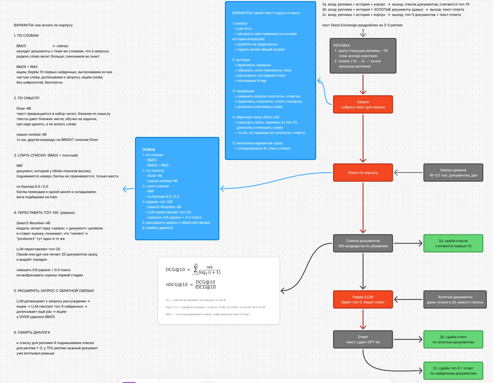

# RETECO 2026 · разговорный поиск и отказ от ответа

Участие в **SemEval-2027 Task 1 (RETECO), трек 2 (RECOR)** - поиск в диалоге.
[Сайт соревнования](https://datascienceuibk.github.io/RETECO/) ·
[данные](https://huggingface.co/datasets/DataScience-UIBK/RETECO-SemEval2027) ·
[кит организаторов](https://github.com/DataScienceUIBK/RETECO)

Цели: препринт на arXiv к ноябрю 2026, сабмит на лидерборд 10-31 января 2027.

## Задача

Вопрос со Stack Exchange разбит на диалог из 3-5 коротких реплик. Реплики
несамостоятельные: «а у 6-баночной сборки напряжение тоже растёт?» без истории
не понять. Для каждой реплики нужно найти в корпусе документы, на которых
строится ответ, и (в 2b, 2c) написать сам ответ.

- 11 доменов: биология, дроны, науки о Земле, экономика, железо, право,
  медицина, политика, психология, робототехника, экология
- корпус домена - 16-121 тыс. коротких документов (медиана 20 слов)
- dev 858 реплик, train 2113
- метрика поиска **nDCG@10**, макро по доменам; ответ судит GPT-4o по пяти осям

| подтрек | вход | выход |
|---|---|---|
| **2a** | реплика + история + корпус | список документов, считаются топ-10 |
| **2b** | реплика + история + **золотые документы** | текст ответа |
| **2c** | реплика + история + корпус | топ-5 документов + текст ответа |

## Над чем работаем

**Поиск (2a).** Как из короткой реплики и истории собрать хороший запрос и как
искать по корпусу: BM25, плотные модели, слияние списков, реранк.

**Отказ от ответа (2b против 2c) - вопрос статьи.** В 2b контекст заведомо
достаточен, в 2c он свой и может не содержать ответа. Для каждой реплики из
qrels известно, сколько золотых документов попало в топ-5, - это метка
достаточности контекста. Смотрим, замечает ли ридер нехватку контекста:
отказывается ли он, когда ответа в документах нет, и выдумывает ли, когда
отвечает. Ридер - [OCC-RAG-1.7B](https://huggingface.co/occ-ai/OCC-RAG-1.7B),
который явно выдаёт статус ANSWERABLE / UNANSWERABLE, плюс открытая модель для
контроля. Поиск разной силы даёт «дозу»: чем слабее поиск, тем чаще в контексте
нет ответа.

## Схема



Красное - то, что мы строим. Варианты для каждого красного блока:

**Запрос - какой текст подать в поиск**
1. вопрос
   - как есть
   - раскрыть местоимения по истории
   - разбить на подвопросы
   - задать более общий вопрос
2. история
   - приклеить целиком
   - обрезать, если сменилась тема
   - расширить последний ответ
   - последние N пар
3. генерация
   - заменить вопрос гипотетическим ответом (HyDE)
   - приклеить гипотетический ответ к вопросу (Query2Doc)
   - дописать ключевые слова
4. обратная связь
   - BM25 + RM3: термины из топ-10 дописать и искать снова
   - LLM видит топ-5 найденного и переписывает запрос (DIVER QExpand)
5. несколько вариантов сразу - сгенерировать N, слить списки

**Поиск**
1. по словам - BM25, BM25 + RM3
2. по смыслу - Diver-Retriever-4B, reason-embed-qwen3-4b
3. слить списки - RRF, по баллам с весами из train
4. реранк - Qwen3-Reranker-4B по топ-100, LLM переставляет топ-20,
   смешать 0.6 реранк + 0.4 поиск
5. память диалога - подмешать списки прошлых реплик

**Ридер** - OCC-RAG-1.7B и открытая модель-контроль; ответ по золоту (2b) и по
топ-5 поиска трёх уровней силы (2c).

Полная доска из Figma с пояснениями: [docs/scheme.webp](docs/scheme.webp).



## Результаты (nDCG@10, макро по 11 доменам)

Всё выбирается по train, dev - только отчёт.

| запрос | поиск | dev | train |
|---|---|---|---|
| реплика | BM25 | 0.1827 | - |
| реплика + история (официальный бейзлайн) | BM25 | 0.4379 | 0.4539 |
| реплика + история | BM25 Lucene / + RM3 | 0.3967 / хуже | 0.4113 / хуже |
| переписанный вопрос | BM25 | 0.3096 | 0.3082 |
| переписанный вопрос + история | BM25 | 0.4496 | 0.4625 |
| обрезать при смене темы | BM25 | 0.4361 | 0.4539 |
| гипотетический ответ (HyDE) | BM25 | 0.4796 | 0.4986 |
| переписанный + гипотетический ответ | BM25 | 0.4928 | 0.5037 |
| реплика + история + гипотетический ответ (Query2Doc) | BM25 | 0.5463 | 0.5584 |
| переписанный + история + гипотетический ответ | BM25 | 0.5448 | 0.5603 |
| **слияние трёх последних по баллам** | BM25 | **0.5496** | **0.5610** |

Лучший на сегодня: +0.112 к официальному бейзлайну, Recall@100 = 0.920, рост во
всех 11 доменах. Переписывания сделаны Claude Sonnet. Память диалога и RM3
ухудшают. Плотные модели, реранк, LLM-запросы и генерация ответов - в
Colab-ноутбуках, результаты ещё не получены.

## Структура

```
scripts/retrieve.py   поиск: BM25 кита, Lucene (+RM3), плотный
scripts/rewrite.py    варианты запроса через LLM
scripts/fuse.py       слияние списков: RRF, по баллам, память диалога
scripts/score.py      nDCG@10, сравнение с бейзлайном
colab/build.py        собирает все ноутбуки (правки только здесь)
colab/*.ipynb         всё, что требует GPU или LLM
docs/                 план, журнал, данные, грабли, источники
```

## Colab-ноутбуки

Тяжёлое считается только в Colab. Данные ноутбуки качают с HF сами, результаты
пишут на Google Drive в `reteco/` и после обрыва продолжают с места остановки.
Перед первым запуском положить папку `colab/drive/reteco` в корень Drive.

| ноутбук | что делает | GPU |
|---|---|---|
| `diver`, `reason_embed` | плотный поиск по всему корпусу | T4 |
| `rerank` | Qwen3-Reranker-4B переставляет топ-100 | T4 |
| `query` | варианты запроса на открытой LLM + QExpand, BM25 кита | A100 / L4 |
| `llm_rerank` | ReasonRank-7B переставляет топ-20 | A100 |
| `generate` | ответы 2b и 2c, статус и уверенность ридера | A100 / L4 |
| `judge` | оценка ответов по пяти осям (открытая модель или GPT-4o) | A100 / L4 |
| `analysis` | все таблицы, бутстреп, сабмит 2a | CPU |

## Локально

Локально только BM25 и подсчёт метрик.

```bash
brew install openjdk@21 uv
uv venv --python 3.12 ~/.reteco-venv
uv pip install --python ~/.reteco-venv/bin/python \
    pyarrow huggingface_hub tqdm gensim pytrec-eval-terrier pyserini sentence-transformers
git clone --depth 1 https://github.com/DataScienceUIBK/RETECO.git vendor/RETECO
~/.reteco-venv/bin/hf download DataScience-UIBK/RETECO-SemEval2027 --repo-type dataset \
    --local-dir data/reteco --include "track2_recor/*" "split_manifest.json"
PY=~/.reteco-venv/bin/python
```

venv лежит вне папки проекта: папка синхронизируется Yandex.Disk.

```bash
$PY scripts/score.py --check-baseline                                    # сверка с таблицей организаторов
$PY scripts/retrieve.py --method bm25 --query hist --out runs/2026-09-28_b1_bm25_hist
$PY scripts/retrieve.py --method bm25 --queries runs/rewrites/q2d/dev.jsonl --out runs/..._q2d
$PY scripts/score.py --runs runs/2026-09-28_b1_bm25_hist
$PY scripts/fuse.py --mode score --runs runs/A runs/B --weights 0.5 0.5 --out runs/AB
```

Если что-то не работает - `docs/gotchas.md`.
