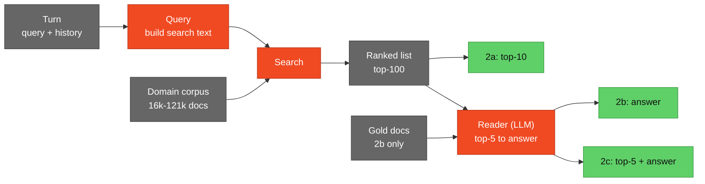

# reteco-2026

Our entry for **SemEval-2027 Task 1 (RETECO), Track 2: conversational retrieval (RECOR)**.
[Task site](https://datascienceuibk.github.io/RETECO/) ·
[data](https://huggingface.co/datasets/DataScience-UIBK/RETECO-SemEval2027) ·
[starter kit](https://github.com/DataScienceUIBK/RETECO)

## Task

A Stack Exchange question is split into a dialogue of 3-5 short turns that are
not self-contained. For each turn:

- **2a** - retrieve supporting documents (nDCG@10, macro over 11 domains)
- **2b** - answer from the gold documents
- **2c** - retrieve, then answer from your own top-5

## Research question

When does the reader know the context is not enough? In 2b the context is
sufficient by construction, in 2c it may not be. qrels give a per-turn
sufficiency label (how many gold docs made it into the top-5). We test whether
[OCC-RAG-1.7B](https://huggingface.co/occ-ai/OCC-RAG-1.7B), which outputs an
explicit ANSWERABLE / UNANSWERABLE status, abstains when evidence is missing,
using first-stage retrievers of different strength as the "dose".

## Pipeline



- **Query** - LLM rewrite, history handling, HyDE / Query2Doc, feedback expansion (DIVER QExpand)
- **Search** - BM25, dense (Diver-Retriever-4B, reason-embed-4B), fusion, rerank (Qwen3-Reranker-4B, ReasonRank-7B)
- **Reader** - OCC-RAG-1.7B vs an open control model

## Results so far (nDCG@10)

| system | dev | train |
|---|---|---|
| BM25, turn only | 0.1827 | - |
| BM25, turn + history (official baseline) | 0.4379 | 0.4539 |
| + LLM rewrite | 0.4496 | 0.4625 |
| + hypothetical passage (Query2Doc) | 0.5463 | 0.5584 |
| score fusion of 3 query variants | **0.5496** | **0.5610** |

Weights are chosen on train. Dense retrieval, reranking and generation are running in Colab.

## Layout

```
scripts/   BM25 retrieval, LLM query variants, fusion, scoring
colab/     GPU notebooks, generated by colab/build.py
docs/      plan, log, data notes (in Russian)
```

Heavy compute runs only in Colab: upload `colab/drive/reteco` to the Drive root,
then open a notebook and Run all. Local setup (BM25 and metrics only) is in
`docs/gotchas.md`.
